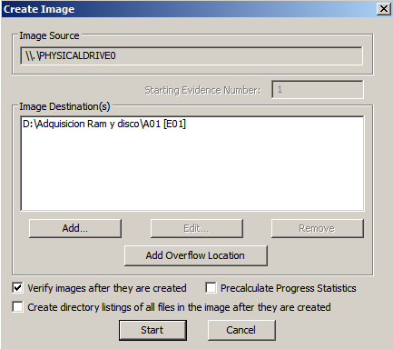

### **Adquisición de Evidencias: Memoria RAM, Disco Duro y Triaje**

La primera fase en la adquisición de evidencias se centra en la captura de la **memoria RAM**, debido a su naturaleza volátil y la posibilidad de que contenga datos importantes en tiempo real. Posteriormente, realizaremos la adquisición del disco duro de la máquina comprometida para obtener una copia exacta (bit a bit) de su contenido.

#### **Adquisición de Memoria RAM**

Para la captura de la memoria RAM, se ha decidido utilizar **RamCapture** debido a su facilidad de uso y la rapidez con la que realiza el proceso de adquisición. Alternativamente, otras herramientas como **FTK Imager** y **DumpIt** también son opciones válidas en entornos de análisis forense. A continuación, se detalla el proceso de adquisición de la memoria RAM mediante RamCapture:

1. **Preparación de la herramienta**: Navegamos a la carpeta de RamCapture para preparar la herramienta.
   

2. **Ejecución como Administrador**: Ejecutamos RamCapture con privilegios de administrador para asegurar que la adquisición se realice sin restricciones y con acceso completo a la memoria.
   

3. **Inicio de la Captura**: Pulsamos el botón "Capture" para iniciar el proceso de adquisición de la memoria RAM.
   

4. **Finalización de la Captura**: Una vez completada la adquisición, el archivo de volcado se guarda en el directorio especificado, con el nombre de archivo `captura_ram.mem` (u otro nombre definido por el analista). En este caso, he creado una carpeta específica para almacenar el archivo y organizar adecuadamente la evidencia.
   

#### **Adquisición del Disco Duro con FTK Imager**

Después de capturar la información más volátil, procedemos con la adquisición forense del disco duro de la máquina comprometida. Para esta tarea, utilizamos **FTK Imager** para crear una imagen física (bit a bit) del disco.

1. **Ejecución de FTK Imager como Administrador**: Es esencial iniciar FTK Imager con privilegios de administrador para evitar problemas de permisos durante la adquisición.
   

2. **Creación de Imagen de Disco**: Seleccionamos la opción "Create Disk Image" para iniciar el proceso.
   

3. **Selección del Tipo de Adquisición**: Elegimos "Physical Drive" para realizar una adquisición completa del disco físico y presionamos "Next".
   

4. **Selección del Disco a Clonar**: Seleccionamos el disco de la máquina comprometida. Por defecto, se muestra el primer disco disponible, pero es importante verificar que sea el disco correcto antes de continuar.
   

5. **Definición de Ubicación para la Imagen**: Configuramos la ubicación donde se almacenará la imagen forense. Presionamos "ADD" para establecer el destino de la adquisición.
   

6. **Formato de Imagen**: Seleccionamos el formato **E01** para la imagen, que permite almacenar metadatos y cálculos hash junto con la imagen.
   

7. **Relleno de Datos**: Introducimos los datos relevantes para la adquisición, incluyendo detalles del caso y del analista forense, para asegurar una documentación adecuada.
   

8. **Nombre y Finalización de la Configuración**: Especificamos el nombre del archivo de la imagen (en este caso, "A01") y presionamos "Finish" para completar la configuración.
   

9. **Inicio de la Adquisición**: Iniciamos la adquisición al pulsar "Start".
   

10. **Proceso de Adquisición en Curso**: Monitoreamos el progreso de la adquisición hasta su finalización.
   

11. **Verificación de la Adquisición**: Al finalizar, FTK Imager muestra los hashes de verificación generados (MD5 y SHA-1), que servirán para confirmar la integridad de la imagen adquirida en futuras verificaciones.
   
   

# Toma de Triaje con Incident Response Triage

## Configuración Inicial
Para iniciar la recopilación de información del sistema mediante **Incident Response Triage**, configuramos el caso con los detalles necesarios. En la ventana de configuración, completamos los siguientes campos:

Una vez completada esta información, presionamos **OK** para continuar.

## Selección de Opciones de Captura
En la interfaz principal de **Incident Response Triage**, seleccionamos las opciones para capturar información crítica del sistema, tales como:

- Información del sistema
- Procesos en ejecución
- Servicios en ejecución
- Handles
- Tareas programadas
- Información del nombre de host
- Información de AutoRun (importante para detectar posibles mecanismos de persistencia)
- Configuración de cuentas de usuario

En este caso, selecciono todas las opciones de captura disponibles para garantizar la recopilación completa de datos en una única ejecución del triaje. Esto permite evitar la necesidad de realizar nuevamente el proceso en caso de requerir información adicional más adelante, optimizando tanto el tiempo como la eficiencia de la respuesta ante incidentes.

Con las opciones configuradas, presionamos el botón **Run** para iniciar el triaje.

## Ejecución de la Herramienta y Progreso de Captura
La herramienta muestra un indicador de progreso mientras realiza la captura de la información seleccionada. Este proceso puede demorar dependiendo de la cantidad de datos a recopilar y de la velocidad del sistema.

## Resultados de la Captura de Memoria con Moonsols Win64dd
Como parte del triaje, también hemos ejecutado **Win64dd de Moonsols** para capturar la memoria física del sistema. Los resultados muestran detalles sobre el uso y disponibilidad de memoria física y virtual, lo cual es útil para el análisis de actividad en memoria.

## Resultado Completado con éxito

